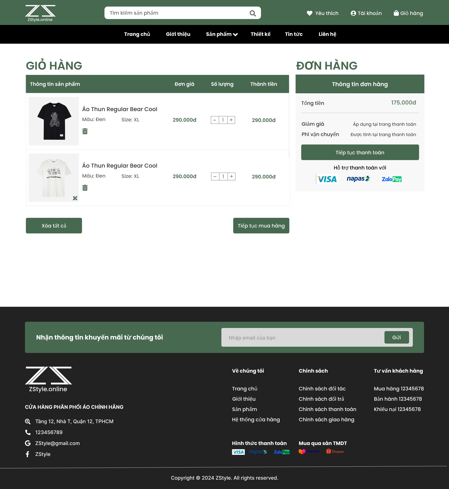
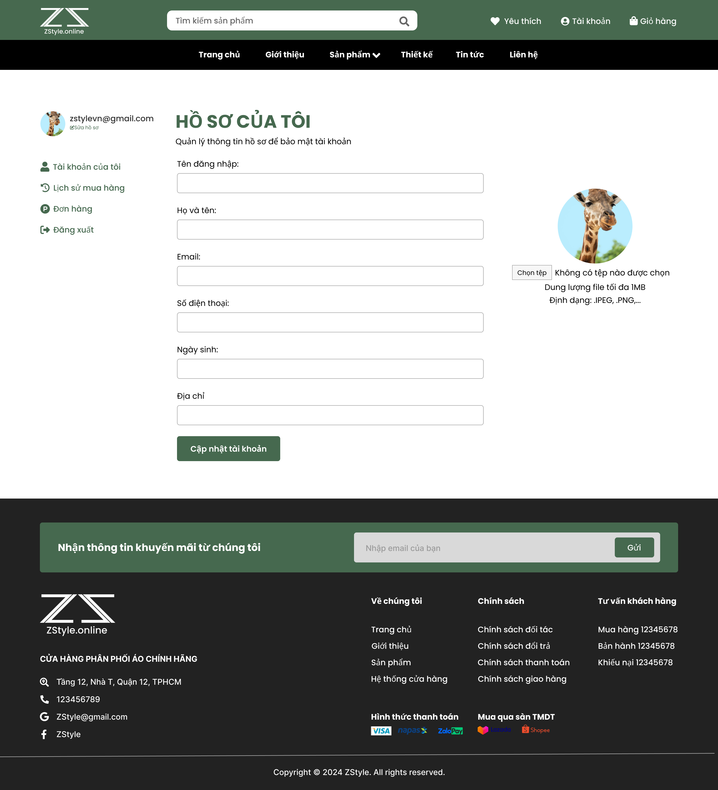
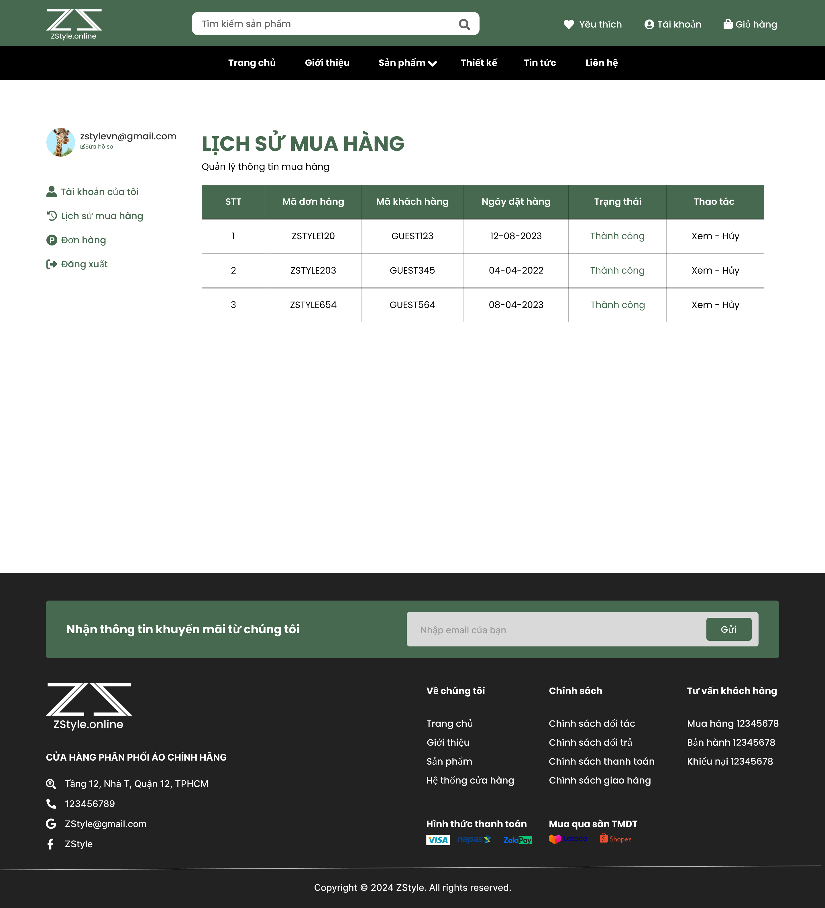
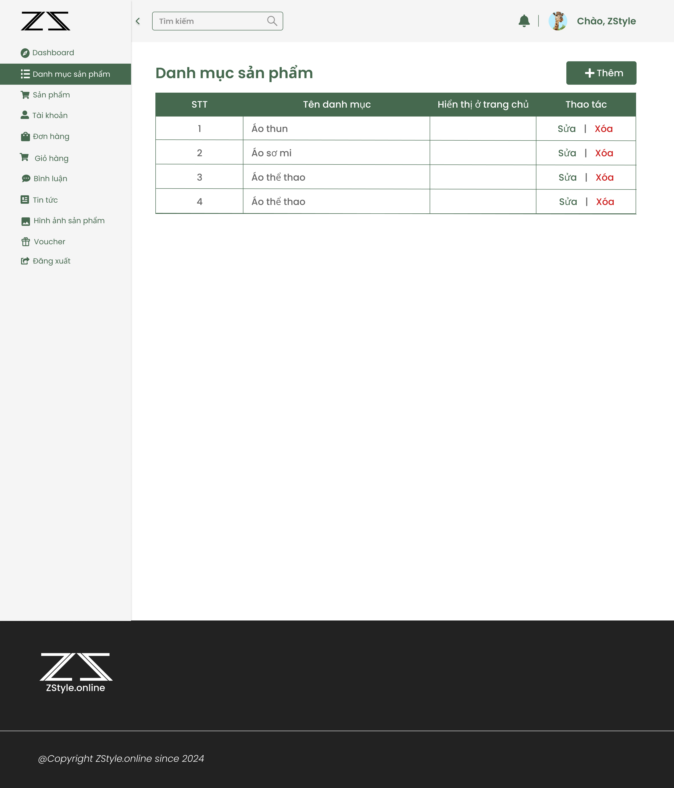
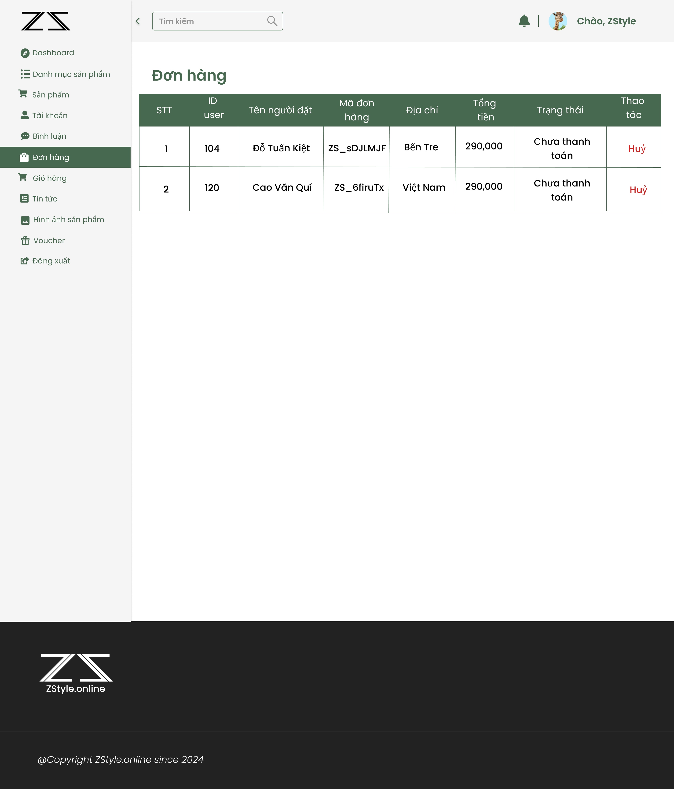
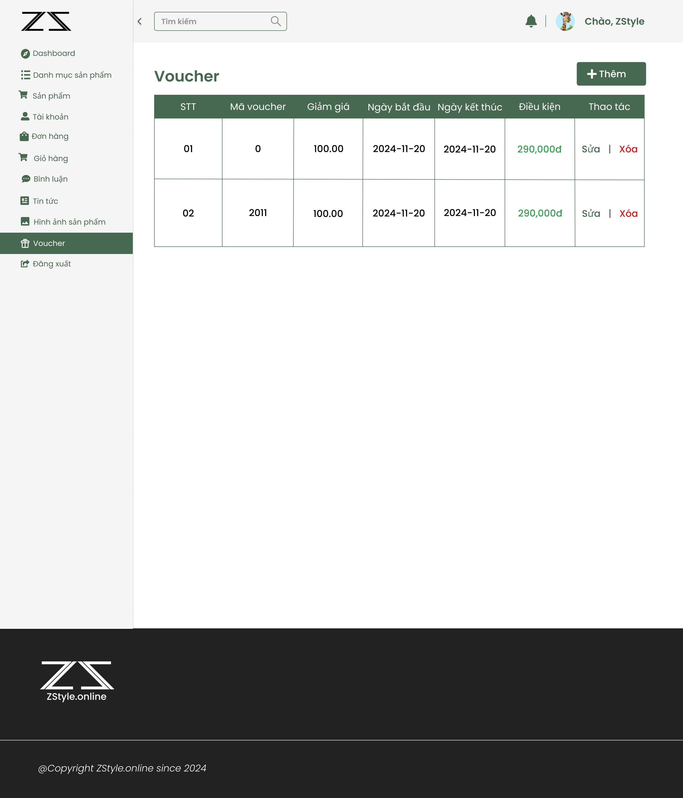
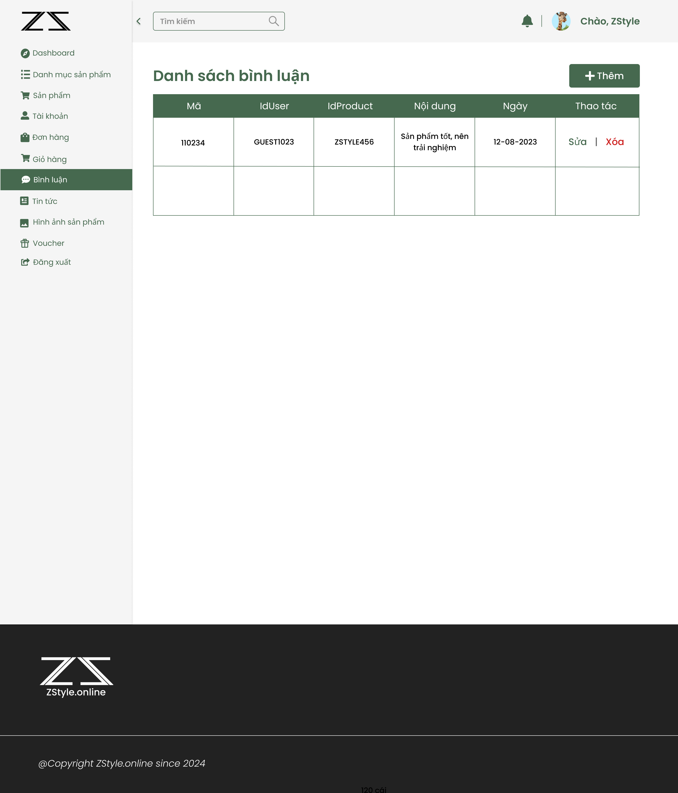

# ZStyle - E-commerce with Testing Focus

An e-commerce platform for fashion products built with PHP and MySQL, with emphasis on comprehensive test coverage including 131 automated tests covering functional, security, and data integrity aspects.

## Contents

- [About](#about)
- [Setup](#setup)
- [Running Tests](#running-tests)
- [Test Suite](#test-suite)
- [Application Interface](#application-interface)
- [Docker](#docker)
- [CI/CD](#cicd)
- [Project Structure](#project-structure)
- [Development](#development)
- [Troubleshooting](#troubleshooting)

## About

ZStyle is an e-commerce platform for fashion products (t-shirts, jackets, polos, etc.). The project demonstrates comprehensive testing practices with 131 total tests:

- **45 Customer Functional Tests**: Product browsing, cart management, checkout, order tracking
- **32 Admin Functional Tests**: Product/user/order management, system administration
- **14 Security Tests**: Authorization, access control, SQL injection, XSS, IDOR prevention
- **12 End-to-End Workflow Tests**: Complete customer purchase flow, admin workflows, access control flows
- **8 Data Integrity Tests**: Database consistency, data synchronization across modules
- **20 Non-functional Tests**: Performance, usability, compatibility, reliability

Test results: 116 passed, 15 failed. Coverage includes authentication, product catalog, shopping cart, checkout, order management, admin operations, and security validation.

### Technology Stack

**Backend**: PHP 8.1+, MySQL 8.0+, MVC Architecture  
**Testing**: PHPUnit 10.5.58, Selenium WebDriver, Guzzle  
**Infrastructure**: Docker, Docker Compose, GitHub Actions

## Setup

### Using Docker (Recommended)

```bash
# Clone and navigate to project
git clone https://github.com/Plinh-Ctuyen-QHung-VHau/Zstyle.git
cd Zstyle

# Start application
docker compose up -d

# Start Selenium for UI tests (optional)
docker compose -f docker-compose.selenium.yml up -d

# Verify containers
docker ps
```

Access the application at:

- Main app: http://localhost:8080
- Admin panel: http://localhost:8080/view/admin/
- Database management: http://localhost:8081 (phpMyAdmin - root/root)

### Manual Setup

1. Prerequisites: PHP 8.1+, MySQL 8.0+, Apache/Nginx, Composer
2. Clone the repository
3. Configure web server to point to project root
4. Create database: `CREATE DATABASE zstyle CHARACTER SET utf8 COLLATE utf8_unicode_ci;`
5. Import schema: `mysql -u root -p zstyle < sources/Zstyle.sql`
6. Update credentials in `sources/model/connectdb.php`
7. Install dependencies: `composer install`

## Running Tests

### All Tests

```bash
# Requires Selenium running for workflow/UI tests
docker exec -it zstyle_webserver vendor/bin/phpunit --testdox
```

### Run by Category

```bash
# Customer functional tests
docker exec -it zstyle_webserver vendor/bin/phpunit --testdox tests/Functional/

# Admin functional tests
docker exec -it zstyle_webserver vendor/bin/phpunit --testdox tests/Admin/

# Security tests
docker exec -it zstyle_webserver vendor/bin/phpunit --testdox tests/Security/

# Data integrity tests
docker exec -it zstyle_webserver vendor/bin/phpunit --testdox tests/DataIntegrity/

# End-to-end workflow tests (requires Selenium)
docker exec -it zstyle_webserver vendor/bin/phpunit --testdox tests/Workflows/

# Non-functional tests
docker exec -it zstyle_webserver vendor/bin/phpunit --testdox tests/NonFunctional/
```

### Fast Testing (No Selenium)

```bash
# Run all tests except workflow/UI tests that require Selenium
docker exec -it zstyle_webserver vendor/bin/phpunit --testdox tests/Functional tests/Admin tests/Security tests/DataIntegrity tests/NonFunctional
```

### Watch Tests Visually

```bash
# Start Selenium with VNC
docker compose -f docker-compose.selenium.yml up -d

# Connect VNC viewer to localhost:7900 (password: secret)
# Run tests in another terminal to watch execution
```

### Debug and Coverage

```bash
# Verbose output
docker exec -it zstyle_webserver vendor/bin/phpunit --testdox --verbose

# Generate coverage report
docker exec -it zstyle_webserver vendor/bin/phpunit --coverage-html coverage
# Open coverage/index.html in browser

# Run single test file
docker exec -it zstyle_webserver vendor/bin/phpunit tests/Functional/CartTest.php --testdox

# Selenium logs
docker logs -f selenium_chrome
```

## Test Suite

The test suite contains 131 total tests organized into 6 categories (116 passed, 15 failed):

### Customer Functional Tests (45)

Test customer-facing features: product browsing, cart management, checkout, order tracking.

- Product display and filtering
- Shopping cart operations
- Order placement and tracking
- Account management
- Payment flow simulation

### Admin Functional Tests (32)

Test administrative features: product/user/order management, system operations.

- Product CRUD operations
- User account management
- Order management and status updates
- Category and voucher management
- Admin dashboard and statistics

### Security Tests (14)

Test authorization, access control, and common web vulnerabilities.

- SQL injection prevention
- Cross-site scripting (XSS) protection
- Insecure direct object reference (IDOR) prevention
- Role-based access control (RBAC)
- Session security and management

### End-to-End Workflow Tests (12)

Test complete business processes spanning multiple modules.

- Complete customer purchase flow: browse → cart → checkout → order
- Admin order processing workflow
- Access control and permission workflows
- Cross-module data consistency

### Data Integrity Tests (8)

Test database consistency and data synchronization.

- Cart and order data synchronization
- Inventory updates
- User and order associations
- Orphaned data prevention
- Transaction rollback on errors

### Non-functional Tests (20)

Test performance, usability, compatibility, and reliability.

- Page load times and response times
- UI/UX correctness and error messages
- Browser compatibility (Chrome, Firefox)
- Form validation and user guidance
- Session timeout and state recovery
- Concurrent operation handling

## Application Interface

### Customer Pages

| Page           | Screenshot                                 |
| -------------- | ------------------------------------------ |
| Home           |            |
| Products       |         |
| Product Detail |  |
| Shopping Cart  |            |
| Checkout       |        |
| Login          |           |
| Register       |         |
| Account        |         |
| Order History  |         |
| News           |            |

### Admin Panel

| Page      | Screenshot                                  |
| --------- | ------------------------------------------- |
| Dashboard |  |
| Products  |  |
| Orders    |    |
| Users     |     |
| Vouchers  |  |
| Comments  |  |

## Docker

### Main Services

`docker-compose.yml` provides:

- **Web Server**: PHP 8.1 + Apache on port 8080
- **Database**: MySQL 8.0 on port 3307
- **Management**: phpMyAdmin on port 8081

Automatically initializes database from `Zstyle.sql` and sets up proper file permissions.

### Selenium Container

`docker-compose.selenium.yml` provides:

- **Browser Automation**: Selenium Chrome standalone server
- **Remote Viewing**: VNC server on port 7900 (password: secret)

Run only when needed for UI testing:

```bash
docker compose -f docker-compose.selenium.yml up -d    # Start
docker compose -f docker-compose.selenium.yml down     # Stop and free ~3GB
```

### Container Commands

```bash
# View running containers
docker ps

# View container logs
docker logs zstyle_webserver
docker logs zstyle_database
docker logs selenium_chrome

# Stop containers
docker compose down
docker compose -f docker-compose.selenium.yml down

# Remove all containers and clean up
docker compose down -v
docker system prune -a
```

## CI/CD

Tests run automatically on GitHub Actions for:

- Push to main or develop branch
- Pull requests to main or develop

Workflow runs: Unit tests → API tests → UI tests → E2E tests → Smoke tests → Coverage report

View results on GitHub in the **Actions** tab. All tests must pass before merging PRs.

## Troubleshooting

**Selenium connection fails**  
Ensure Selenium container is running: `docker compose -f docker-compose.selenium.yml up -d`

**UI tests fail with "element not found"**  
Check if the page loads correctly in VNC. Verify test URL parameters use `pg=` instead of `act=`.

**Database connection error**  
Verify MySQL is running and credentials in `model/connectdb.php` are correct.

**Port already in use**  
Stop conflicting containers or change ports in docker-compose.yml.

## Project Structure

```
sources/
  model/                    # Business logic layer
    connectdb.php          # Database connection
    user.php               # User management
    product.php            # Product functions
    cart.php               # Shopping cart
    donhang.php            # Orders
    ...
  view/                    # Presentation layer
    header.php
    footer.php
    home.php
    product.php
    cart.php
    checkout.php
    login.php
    register.php
    account.php
    news.php
    admin/                 # Admin panel
  tests/                   # Test suite
    Unit/                  # Unit tests (23)
    API/                   # API tests (20)
    UI/                    # UI tests (22)
      LoginUITest.php
      ProductUITest.php
      CartUITest.php
      E2EShoppingFlowTest.php
      SmokeUITest.php
  phpunit.xml              # PHPUnit configuration
  docker-compose.yml       # Main services
  docker-compose.selenium.yml  # Selenium service
  Dockerfile               # PHP container image
  Zstyle.sql              # Database schema
  index.php               # Application router
  mailer.php              # Email handler

PROJECT_FULL_ANALYSIS.md  # Detailed testing analysis
README.md                 # This file
```

## Development

### Adding Features

1. Create a feature branch: `git checkout -b feature/YourFeature`
2. Write tests first (TDD approach recommended)
3. Implement the feature
4. Run all tests: `vendor/bin/phpunit --testdox`
5. Ensure all 65 tests pass
6. Commit and push
7. Create a pull request

### Code Standards

- Test all new functionality
- Update relevant tests when modifying existing code
- Follow MVC architecture pattern
- Use PDO for database queries (prepared statements for security)
- Test coverage should maintain or improve overall metrics

## Testing Methodologies

The test suite employs multiple approaches:

- **Black-box testing**: Validates functionality without examining implementation
- **White-box testing**: Verifies internal logic and code paths
- **Business logic testing**: Tests critical workflows end-to-end (registration → login → purchase)
- **Security testing**: Validates SQL injection prevention, XSS prevention, unauthorized access control
- **Integration testing**: Confirms modules work together (model → controller → view)

## Troubleshooting

### Selenium Connection Issues

```bash
# Verify Selenium is running
docker ps | grep selenium

# Start Selenium if not running
docker compose -f docker-compose.selenium.yml up -d

# Check network connectivity
docker network inspect zstyle_network
```

### UI Test Failures

- Check page loads correctly in VNC (localhost:7900)
- Verify test URL parameters use `pg=` instead of `act=`
- Increase wait times if page loads slowly
- Check Selenium logs: `docker logs -f selenium_chrome`

### Database Connection Error

```bash
# Verify MySQL is running
docker ps | grep zstyle_database

# Check credentials in sources/model/connectdb.php
# Verify database imported: docker exec zstyle_database mysql -u root -p -e "USE zstyle; SHOW TABLES;"
```

### Port Already in Use

Change ports in docker-compose.yml or stop existing containers:

```bash
docker ps
docker stop <container_name>
```

### Disk Space (Selenium)

```bash
# Stop Selenium container (saves ~3GB)
docker compose -f docker-compose.selenium.yml down

# Clean up unused Docker resources
docker system prune -a
```

## Contributing

1. Fork the repository
2. Create a feature branch
3. Write tests for new functionality
4. Ensure all 65 tests pass
5. Commit with clear messages
6. Push to your branch
7. Open a pull request

All pull requests must pass CI/CD checks before merging.

## Team

- Phuc linh - Leader
- Cong tuyen
- Quoc Hung
- Van Hau

## Documentation

- [PROJECT_FULL_ANALYSIS.md](PROJECT_FULL_ANALYSIS.md) - Comprehensive testing analysis, methodologies, and test case examples
- [sources/README_TESTING.md](sources/README_TESTING.md) - Detailed automation testing guide and configuration
- [sources/DOCKER_SETUP.md](sources/DOCKER_SETUP.md) - Docker configuration and troubleshooting

## License

MIT License - see LICENSE file for details
