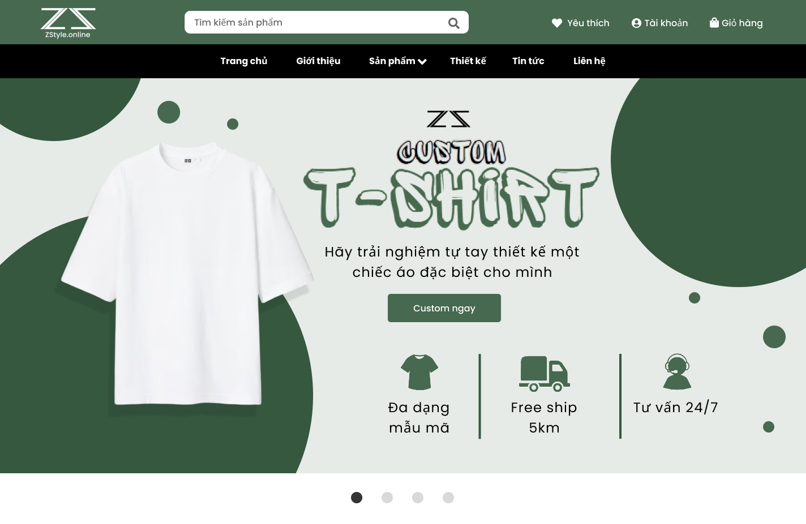
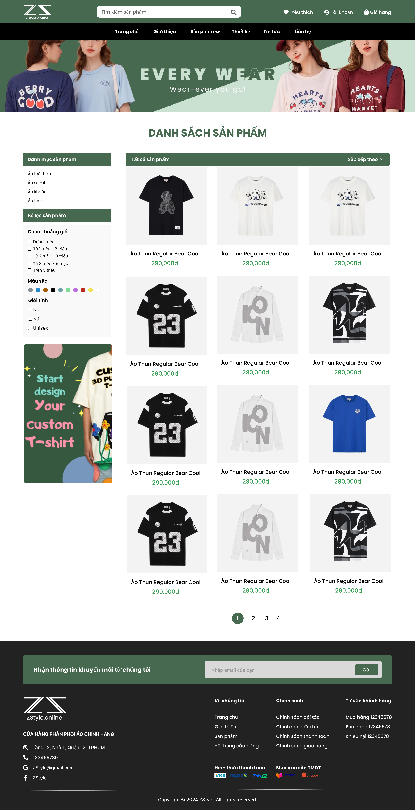
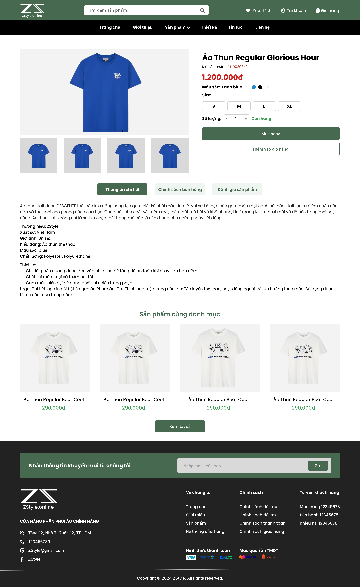
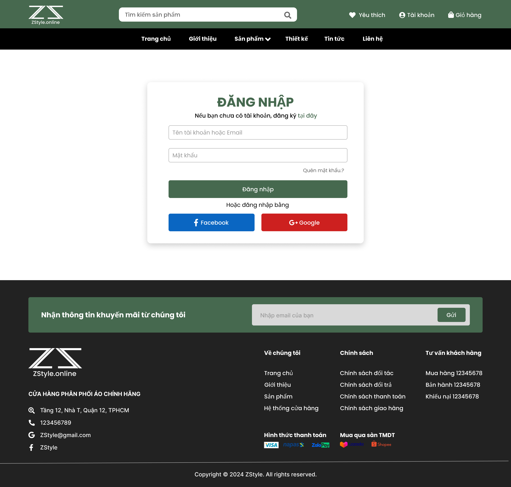
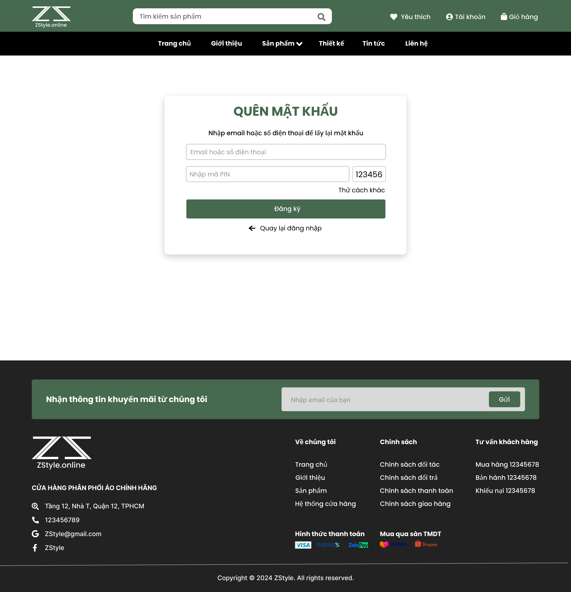
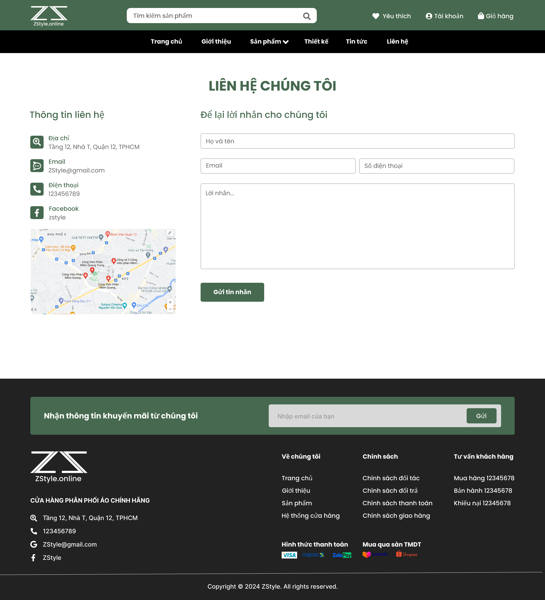
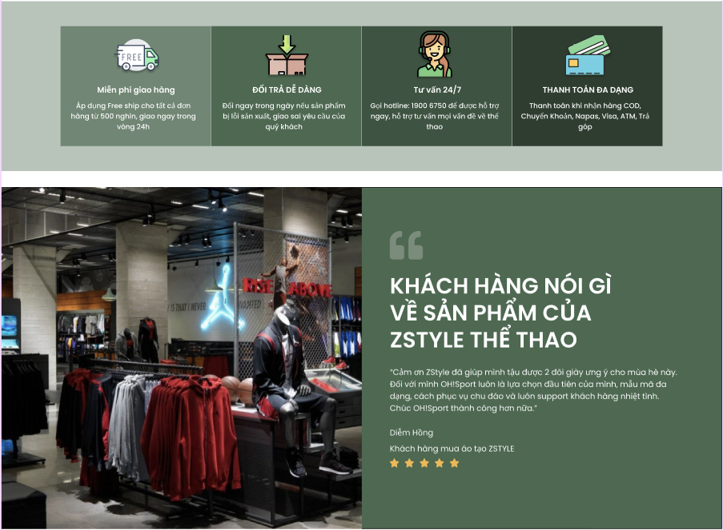
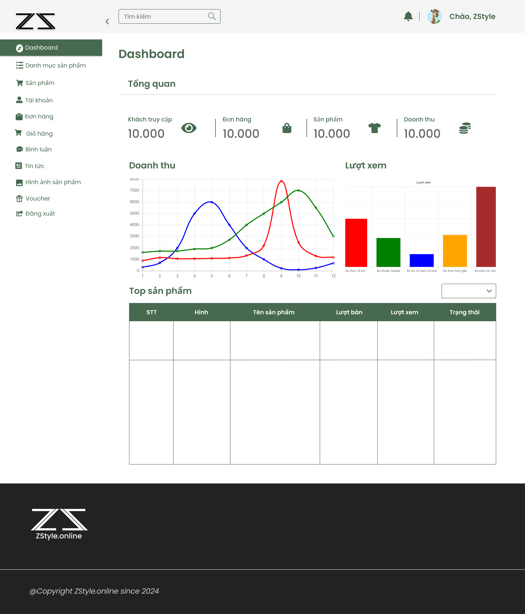
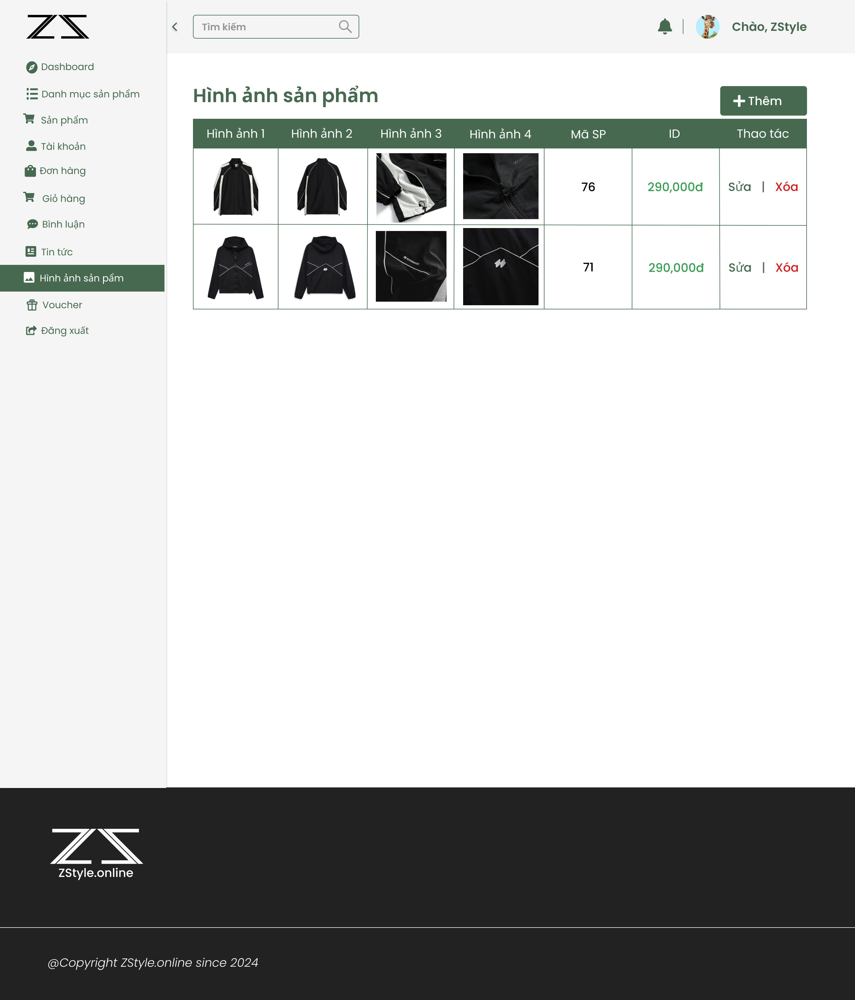
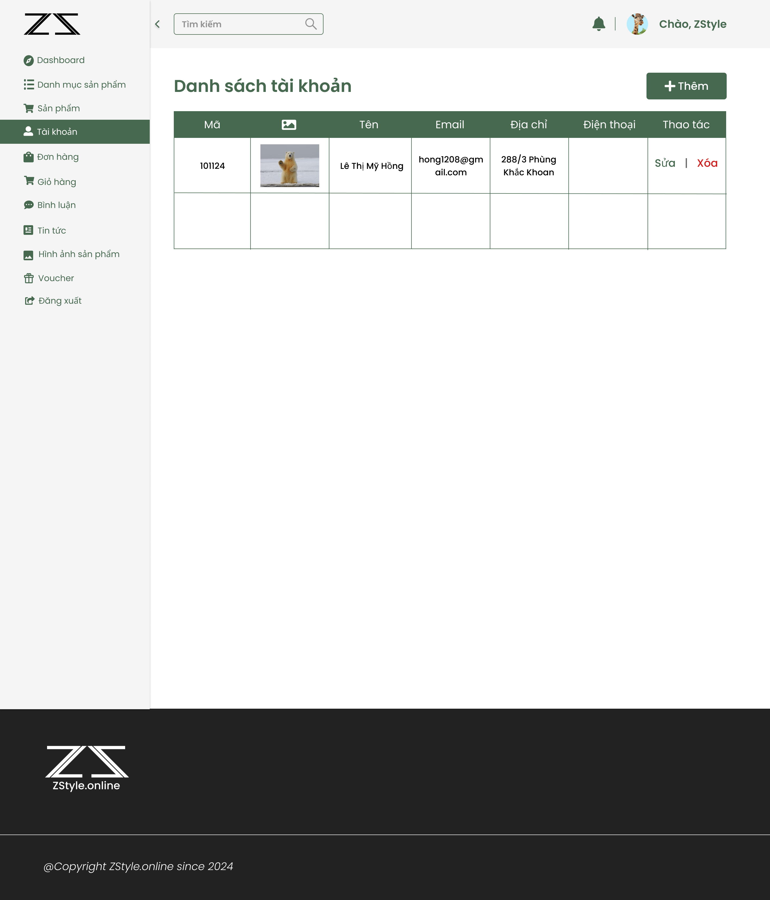

# ZStyle - E-Commerce Fashion Website

## Table of Contents

- [About](#about)
- [Features](#features)
- [Technologies](#technologies)
- [Installation](#installation)
- [Docker Setup](#docker-setup)
- [Database Setup](#database-setup)
- [Configuration](#configuration)
- [Project Structure](#project-structure)
- [Usage](#usage)
- [Admin Panel](#admin-panel)
- [Interface Screens](#interface-screens-user-interface-overview)
- [Contributing](#contributing)
- [License](#license)

## About

**ZStyle** is a comprehensive e-commerce platform specializing in fashion products with a unique custom design feature. The platform allows customers to browse, purchase ready-made fashion items, and create their own custom-designed apparel. Built with PHP and MySQL, ZStyle offers a full-featured shopping experience with user management, order tracking, and administrative tools.

## Features


### Customer Features

- **Product Browsing & Search**

  - Browse products by category (Áo thun, Áo khoác, Áo sơ mi, Áo polo, etc.)
  - Advanced filtering (price, color, gender, size)
  - Search functionality with keyword matching
  - Product sorting (A-Z, Z-A, price ascending/descending)

- **Shopping Experience**

  - Shopping cart management
  - Wishlist functionality
  - Product reviews and ratings (1-5 stars)
  - Product detail views with multiple images and colors
  - Size and color selection
  - Real-time stock inventory tracking

- **User Account Management**

  - User registration and login
  - Profile management
  - Order history tracking
  - Password recovery via email
  - Account activation system

- **Checkout & Payment**

  - Multiple payment methods:
    - Cash on delivery (COD)
    - Credit/Debit card
    - MoMo wallet
  - Express shipping option
  - Voucher/discount code system
  - Email order confirmation

### Admin Panel Features

- **Dashboard**

  - Overview statistics
  - Revenue analytics by month
  - Product view statistics by category
  - Total revenue tracking
  - Customer visit tracking

- **Product Management**

  - Add/Edit/Delete products
  - Product categorization
  - Price management (regular & sale prices)
  - Product attributes (hot, featured, bestseller, trending)
  - Multi-image upload for products
  - Color and size variant management
  - Stock inventory control

- **Category Management**

  - Create/Update/Delete categories
  - Category display order
  - Homepage category visibility

- **Order Management**

  - View all orders
  - Order status tracking (Pending, Processing, Shipping, Completed, Cancelled)
  - Order details view
  - Order search functionality

- **User Management**

  - View customer accounts
  - User role management (admin/customer)
  - Account activation/deactivation
  - User profile editing

- **Comment Management**

  - Monitor product reviews
  - Moderate customer feedback

## Technologies

### Backend

- **PHP 7.4+** - Server-side scripting
- **MySQL 8.0+** - Database management
- **PDO** - Database abstraction layer
- **PHPMailer** - Email functionality

### Frontend

- **HTML5** - Structure
- **CSS3** - Styling
- **JavaScript/jQuery** - Client-side functionality
- **Slick Carousel** - Image sliders
- **Font Awesome** - Icons
- **Ion Icons** - Additional icons

### Architecture

- **MVC Pattern** - Model-View-Controller architecture
- **Session Management** - User authentication and cart management
- **AJAX** - Asynchronous data loading

## Installation

### Prerequisites

- PHP 7.4 or higher
- MySQL 8.0 or higher
- Apache/Nginx web server
- Composer (optional)

### Step 1: Clone the Repository

```bash
git clone https://github.com/Plinh-Ctuyen-QHung-VHau/Zstyle.git
cd Zstyle
```

### Step 2: Configure Web Server

Point your web server's document root to the project directory.

For **XAMPP/WAMP**:

- Move the project to `htdocs` or `www` folder
- Access via `http://localhost/Zstyle`

### Step 3: Set Permissions

```bash
# Linux/Mac
chmod -R 755 upload/
chmod -R 755 view/layout/assets/images/

# Windows - Ensure write permissions on these folders
```

## Docker Setup

For easy deployment using Docker containers, see the [Docker Setup Guide](DOCKER_SETUP.md).

### Quick Start with Docker

```bash
# Start all services (web server, database, phpMyAdmin)
docker-compose up -d

# Access the application
# Main app: http://localhost:8080
# phpMyAdmin: http://localhost:8081
```

The Docker setup includes:

- **Web Server**: PHP 8.1 + Apache (Port 8080)
- **Database**: MySQL 8.0 (Port 3307)
- **phpMyAdmin**: Database management interface (Port 8081)
- Automatic database initialization from `Zstyle.sql`
- Proper file permissions for uploads

For detailed Docker instructions, troubleshooting, and commands, see [DOCKER_SETUP.md](DOCKER_SETUP.md).

## Database Setup

### Step 1: Create Database

1. Open phpMyAdmin or MySQL command line
2. Create a new database named `zstyle`:

```sql
CREATE DATABASE zstyle CHARACTER SET utf8 COLLATE utf8_unicode_ci;
```

### Step 2: Import Database

1. Import the `Zstyle.sql` file:

```bash
mysql -u root -p zstyle < Zstyle.sql
```

Or use phpMyAdmin to import the SQL file.

### Step 3: Database Configuration

Edit `model/connectdb.php` with your database credentials:

```php
function pdo_get_connection(){
   $dburl = "mysql:host=localhost;dbname=zstyle;charset=utf8";
   $username = 'root';
   $password = 'your_password';
   // ...
}
```

## Configuration

### Email Configuration

Edit `mailer.php` to configure email settings:

```php
$mail->Host       = 'smtp.gmail.com';
$mail->Username   = 'your-email@gmail.com';
$mail->Password   = 'your-app-password';
```

**Note**: For Gmail, you need to generate an App Password from your Google Account settings.

### Admin Account

Default admin credentials (change after first login):

- Check the `users` table for admin account
- Admin role: `role = 1`
- Customer role: `role = 0`

## Project Structure

```
Zstyle/
├── ajax/                      # AJAX handlers
│   ├── giohangview.html      # Cart view template
│   └── soluongsp.php         # Product quantity handler
├── mailer/                    # Email templates
│   ├── mailer.php
│   ├── mailer1.php
│   └── mailer2.php
├── model/                     # Data layer (MVC)
│   ├── connectdb.php         # Database connection
│   ├── product.php           # Product functions
│   ├── catalog.php           # Category functions
│   ├── cart.php              # Shopping cart functions
│   ├── user.php              # User management
│   ├── donhang.php           # Order functions
│   ├── design.php            # Custom design functions
│   ├── voucher.php           # Voucher functions
│   ├── comment.php           # Review functions
│   ├── thongke.php           # Statistics functions
│   └── ...
├── PHPMailer-master/          # PHPMailer library
├── upload/                    # Uploaded images
├── view/                      # View layer (MVC)
│   ├── header.php            # Site header
│   ├── footer.php            # Site footer
│   ├── home.php              # Homepage
│   ├── product.php           # Product listing
│   ├── detail.php            # Product detail
│   ├── cart.php              # Shopping cart
│   ├── checkout.php          # Checkout page
│   ├── login.php             # Login page
│   ├── register.php          # Registration page
│   ├── account.php           # User account
│   ├── news.php              # News/blog page
│   ├── admin/                # Admin panel views
│   │   ├── index.php         # Admin router
│   │   ├── header.php        # Admin header
│   │   ├── dashboard.php     # Admin dashboard
│   │   ├── product.php       # Product management
│   │   ├── catalog.php       # Category management
│   │   ├── cart.php          # Order management
│   │   ├── user.php          # User management
│   │   ├── voucher.php       # Voucher management
│   │   └── ...
│   └── layout/               # Frontend assets
│       └── assets/
│           ├── css/          # Stylesheets
│           ├── js/           # JavaScript files
│           └── images/       # Static images
├── index.php                  # Main application router
├── mailer.php                 # Email sending script
├── save_img.php              # Design image handler
├── Zstyle.sql                # Database schema
├── LICENSE                    # License file
└── README.md                 # This file
```

## Usage

### Customer Usage

#### 1. Browse Products

- Navigate to `http://localhost/Zstyle`
- Browse categories or use search
- Filter by price, color, gender

#### 2. Create Custom Design

- Click on "Thiết kế ngay" (Design Now)
- Upload images or use design tools
- Preview front and back of t-shirt
- Add to cart

#### 3. Shopping Cart

- Add products to cart
- Adjust quantities
- Apply voucher codes
- Proceed to checkout

#### 4. Place Order

- Fill in shipping information
- Select payment method
- Choose shipping speed
- Confirm order
- Receive email confirmation

#### 5. Account Management

- Register/Login to account
- View order history
- Update profile information
- Track order status

### Admin Usage

#### 1. Login to Admin Panel

- Navigate to `http://localhost/Zstyle/view/admin/`
- Login with admin credentials

#### 2. Manage Products

- Add new products with images, colors, sizes
- Set prices and discounts
- Mark products as hot, featured, bestseller
- Track inventory levels

#### 3. Process Orders

- View incoming orders
- Update order status
- View order details
- Track payments

#### 4. Manage Customers

- View customer list
- Edit customer information
- Activate/deactivate accounts

#### 5. Create Promotions

- Create voucher codes
- Set discount percentages
- Define validity periods

#### 6. View Analytics

- Check revenue statistics
- Monitor product views
- Track customer engagement

## Security Features

- **Password Hashing** - User passwords are securely hashed
- **SQL Injection Prevention** - PDO prepared statements
- **Session Management** - Secure session handling
- **Email Verification** - Account activation system
- **Role-Based Access Control** - Admin/Customer separation
- **XSS Prevention** - Input sanitization

## Email Features

The system sends automated emails for:

- Order confirmations with order details
- Account activation
- Password recovery
- Order status updates

## Troubleshooting

### Common Issues

**Issue**: Images not displaying

- **Solution**: Check file permissions on `upload/` folder

**Issue**: Email not sending

- **Solution**: Configure SMTP settings in `mailer.php` and enable "Less secure app access" or use App Password for Gmail

**Issue**: Database connection error

- **Solution**: Verify database credentials in `model/connectdb.php`

**Issue**: Session errors

- **Solution**: Ensure PHP session is enabled and `session.save_path` is writable

## Interface Screens (User Interface Overview)

This section outlines the primary user interface screens available in the application, corresponding to the visual assets located in the `screenshot/` directory. These screens serve as the basis for UI/UX validation and functional testing.

### Customer Interface

The customer-facing interface facilitates product discovery, account management, and transaction processing.

### UI Screens

| Screen          | Preview                                                      |
| --------------- | ------------------------------------------------------------ |
| Home Page       | <br/>       |
| Product List    | <br/> |
| Product Detail  |                            |
| Cart            |                                      |
| Checkout        |                                  |
| Login           |                                     |
| Sign Up         |                                   |
| Forgot Password |                           |
| Profile         |                                   |
| Order History   |                                   |
| News            |                                      |
| About           |                                     |
| Contact         |                                   |
| Policy          |                                    |

## Admin Interface

The admin interface provides management capabilities for system data and business operations.

### UI Screens

| Screen                   | Preview                                                                      |
| ------------------------ | ---------------------------------------------------------------------------- |
| Admin Dashboard          |                                           |
| Product Management       | <br/> |
| Product Image Management |                                       |
| Order Management         | <br/>              |
| User Management          |                                              |
| Voucher Management       |                                           |
| Comment Management       |                                           |
| News Management          |                                              |

## Contributing

Contributions are welcome! Please follow these steps:

1. Fork the repository
2. Create a feature branch (`git checkout -b feature/AmazingFeature`)
3. Commit your changes (`git commit -m 'Add some AmazingFeature'`)
4. Push to the branch (`git push origin feature/AmazingFeature`)
5. Open a Pull Request

## Development Team

- **Plinh** - Developer
- **Ctuyen** - Developer
- **QHung** - Developer
- **VHau** - Developer

## License

This project is licensed under the MIT License - see the [LICENSE](LICENSE) file for details.

## Acknowledgments

- PHPMailer for email functionality
- Font Awesome for icons
- Slick Carousel for image sliders
- All contributors and testers

---

<div align="center">
  Made with love by ZStyle Team
  
  **Happy Shopping!**
</div>
